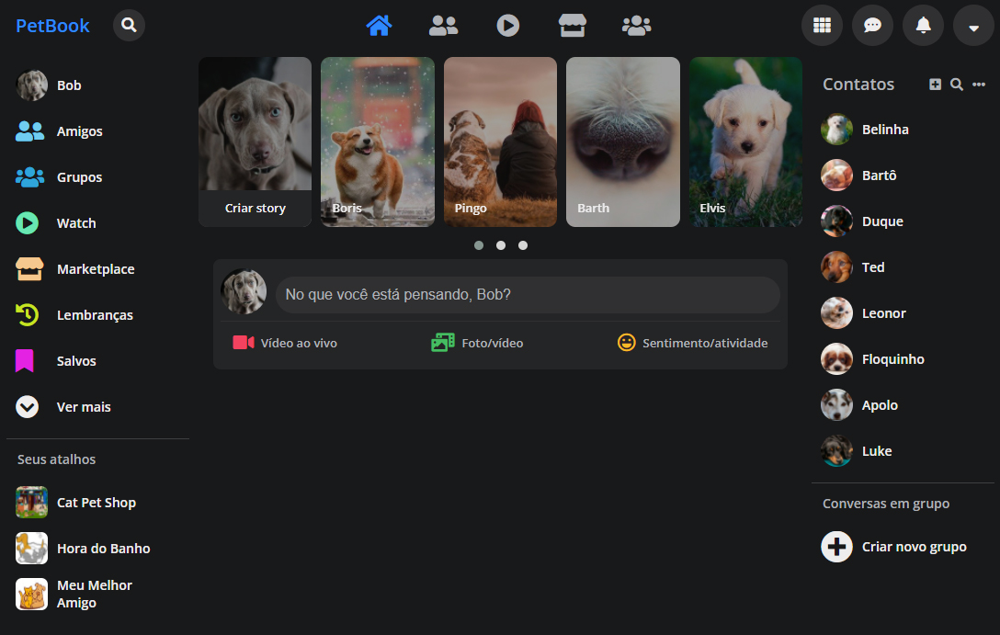

# Petbook
## Uma rede social para postagens sobre os queridos pets.
---
Material desenvolvido com base no aprendizado das videoaulas do Bootcamp da Digital Innovation One.

Com finalidade didática, após acompanhar as aulas e recriar o clone do Netflix, apliquei novamente o que aprendi e criei esta página Petbook com base no layout do Facebook.

URL da página:
<https://celsorv.github.io/petbook>

---

---

## Tecnologias envolvidas:
- HTML 5
- CSS 3
- Javascript
- JQuery
- Font Awesome
- owlCarousel2

## Conceitos envolvidos:
Flexbox, responsividade, posicionamento de elementos na tela e demais recursos HTML5 e CSS 3.
